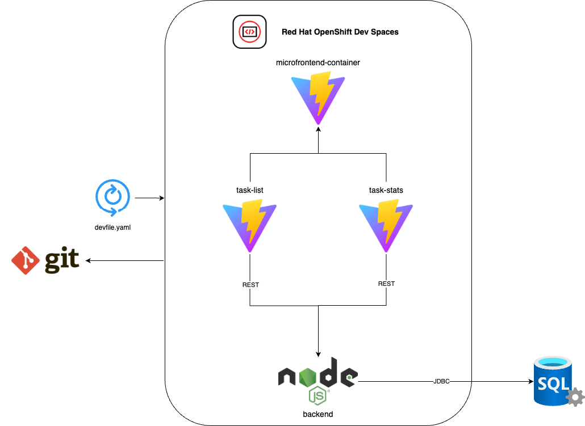

## Demo Dev Spaces + Node.js/SQL Server backend + Vite microfrontends

## 1. Database creation
- Create SQL Database Server: 
    - Development
    - General Purpose - Serverless
    - Locally-redundant backup storage 
    - Public endpoint
    - No firewall rules

- Set .env values and start the backend app. 

## 2. Azure API Manager
- Create an API Manager Resource

## 3. Install Red Hat OpenShift Dev Spaces
- Install operator and create a Che Cluster instance.
